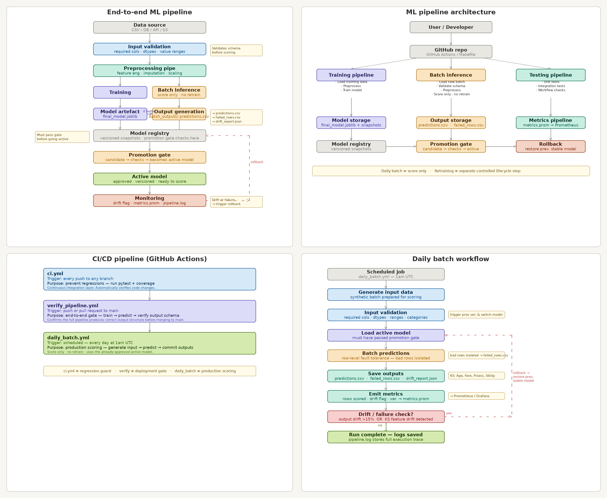

# End-to-End ML Pipeline

**Why this project matters:**
Most ML learning stops at model training. This project covers the full lifecycle — experimentation, production code, testing, automated scoring, monitoring, and observability — built the way an engineering team would actually maintain it.

- Built to learn the full ML lifecycle, not just modelling
- Covers training, batch scoring, testing, monitoring, CI/CD, and automation
- Designed with real production trade-offs: fault tolerance, schema validation, drift detection, model versioning
- Every decision documented with reasoning and trade-offs

> **Dataset:** Titanic survival prediction
> **Model:** CatBoostClassifier | **CV AUC:** 0.8966 | **Recall:** 0.841

---

## Architecture



---

## Project Structure

```
end_to_end_ml_pipeline/
│
├── data/
│   └── raw/
│       ├── train.csv               # Training data
│       ├── test.csv                # Static test data
│       └── daily_input.csv         # Generated daily by scripts/generate_sample_data.py
│
├── experiments/                    # One folder per experiment
│   ├── exp_001_baseline/
│   ├── exp_002_imbalanced/
│   ├── exp_003_feature_engineering/
│   ├── exp_004_model_selection/
│   ├── exp_005_hyperparameter_tuning/
│   ├── exp_006_model_finalisation/
│   └── results.md                  # Master tracker — all experiment outcomes
│
├── config/
│   └── config.yaml                 # All pipeline settings + experiment lineage
│
├── src/
│   └── pipeline/
│       ├── __init__.py             # Package entrypoint
│       ├── pipeline.py             # Thin CLI wrapper
│       ├── train.py                # Training logic
│       ├── predict.py              # Batch prediction logic
│       ├── evaluate.py             # Evaluation + drift detection
│       ├── monitoring.py           # Logging + Prometheus metrics
│       ├── io.py                   # Config/data loading + schema validation
│       └── utils.py                # Preprocessing functions
│
├── models/
│   ├── final_model.joblib          # Latest trained model artefacts
│   ├── model_<timestamp>.joblib    # Versioned model snapshots
│   ├── metrics.prom                # Prometheus metrics written after each batch run
│   └── batch_outputs/             # Prediction CSVs from each batch run
│
├── scripts/
│   ├── train.sh                    # Run training
│   ├── batch_predict.sh            # Run batch prediction
│   └── generate_sample_data.py    # Generate synthetic daily input data
│
├── logs/
│   └── pipeline.log                # Timestamped log of every pipeline run
│
├── .github/
│   └── workflows/
│       ├── ci.yml                  # Run tests on every push
│       ├── verify_pipeline.yml     # End-to-end smoke test on push or PR to main
│       └── daily_batch.yml         # Cron: generate data → predict → commit (score only, no retrain)
│
├── tests/
│   ├── test_pipeline.py            # Unit tests — preprocessing functions (utils.py)
│   └── test_integration.py        # Integration tests — artefacts, schema, fault tolerance, drift, CLI
│
├── Makefile                        # make train / make test / make predict / make reproduce
├── pyproject.toml                  # Project metadata and tool config
├── COMMANDS.md                     # Quick reference for all commands
├── requirements.txt                # Unpinned dependencies
├── requirements-lock.txt           # Pinned versions for reproducibility
└── .gitignore
```

---

## Final Model

| Setting | Value |
|---|---|
| Model | CatBoostClassifier |
| Imbalance handling | RandomUnderSampler |
| Features | 17 (after dropping 8 near-zero importance) |
| CV ROC-AUC | 0.8966 |
| Hold-out AUC | 0.8482 |
| Hold-out Recall | 0.841 |
| Hold-out Precision | 0.73 |
| Hold-out F1 | 0.784 |
| Hold-out Accuracy | 0.82 |
| Decision threshold | 0.46 |
| Calibration | Not applied (negligible improvement) |

---

## Experiment Lineage

| Experiment | Change | Key Result |
|---|---|---|
| exp_001 | Baseline Random Forest | CV AUC 0.8741, Recall 0.68 |
| exp_002 | Imbalance handling | RandomUnderSampler chosen → Recall 0.77 |
| exp_003 | Feature engineering | LogFare, AgeGroup, FamilySize, IsAlone, Pclass×Fare → F1 0.73, Recall 0.81 |
| exp_004 | Model selection | CatBoost wins, CV AUC 0.8909. Ensembling ruled out (71.8% error overlap) |
| exp_005 | Hyperparameter tuning | Defaults near-optimal, tuning degraded results |
| exp_006 | Finalisation | 17 features, threshold 0.46, CV AUC 0.8966 |

---

## Quick Start

```bash
# 1. Clone and install
git clone https://github.com/ceggaway/end_to_end_ml.git
cd end_to_end_ml
make install

# 2. Reproduce the final model exactly
make reproduce

# 3. Run batch prediction on synthetic daily data
make predict

# 4. Run all tests
make test
```

Or use individual commands — see [COMMANDS.md](COMMANDS.md).

---

## Batch Prediction

Each batch run:
- Validates input schema: required columns, dtypes, value ranges, allowed categories
- Processes rows individually — if one row fails, the rest complete normally
- Runs output drift check — warns if batch survival rate deviates >15% from training baseline
- Runs feature-level drift check — KS test on Age, Fare, Pclass, SibSp, Parch
- Saves predictions to `models/batch_outputs/predictions_<timestamp>.csv`
- Saves any failed rows to `models/batch_outputs/failed_rows.csv`
- Saves drift report to `models/batch_outputs/drift_report.json`
- Writes metrics to `models/metrics.prom` for Prometheus to scrape
- Logs everything to `logs/pipeline.log`

---

## CI/CD

| Workflow | Trigger | What it does |
|---|---|---|
| `ci.yml` | Every push to any branch | Runs all tests with coverage |
| `verify_pipeline.yml` | Push or PR to main | Train → predict → verify output schema |
| `daily_batch.yml` | 1am UTC daily | Generate data → predict (no retrain) → commit output |

**Note:** Scoring and retraining are intentionally separate. The daily job scores with the existing model. Retraining is a deliberate, manual action — not an automatic daily event.

---

## Monitoring

Prometheus + Grafana running locally.

```bash
brew services start node_exporter   # http://localhost:9100
brew services start prometheus       # http://localhost:9090
brew services start grafana          # http://localhost:3000
```

Metrics written after each batch run:
- `batch_total_rows` — rows scored
- `batch_failed_rows` — rows that failed
- `batch_pct_survived` — fraction predicted survived
- `batch_success` — 1 if batch completed, 0 if it crashed
- `batch_drift_flag` — 1 if output or feature drift detected
- `batch_timestamp` — Unix timestamp of run
- `batch_model_version` — model version used for scoring

---

## Design Decisions

**Why CatBoost over Random Forest?**
Random Forest was the baseline (exp_001). In exp_004, CatBoost improved CV AUC from 0.874 to 0.891 — the largest single jump across all experiments. CatBoost's ordered boosting reduces overfitting on small tabular datasets and handles categorical features natively.

**Why Random Undersampling?**
Titanic has ~62/38 class imbalance (Not Survived / Survived). Undersampling was chosen in exp_002 because it maximises Recall on the minority class (Survived = 0.77), which is the harder and more interesting class to predict. Oversampling and `class_weight=balanced` gave better F1 but lower recall.

**Why threshold 0.46 instead of 0.5?**
Tuned in exp_006. Lowering the threshold means the model predicts Survived more readily, increasing Recall from 0.783 to 0.841 (+0.058) with a small F1 improvement (+0.023). In a real use case, missing a survivor (false negative) is worse than a false alarm (false positive) — so recall matters more than precision here.

**Why per-row fault tolerance in batch predict?**
In a real batch job, one malformed row should not cancel predictions for 418 others. Processing row-by-row with try/except ensures partial batches still produce usable output, and failed rows are logged separately for investigation.

**Why separate scoring and retraining cadences?**
Retraining every day regardless of whether anything changed is wasteful and risky. In production, retraining should be triggered by explicit criteria — data drift, performance degradation, or a new data version. This project separates daily scoring from retrain logic so the distinction is clear.

**Why no calibration?**
Tested in exp_006. CatBoost's Brier score improved by only 0.0008 with calibration — negligible. Calibration adds complexity and a dependency on the calibration set size. Not worth it here.

---

## Trade-offs

| Decision | What was gained | What was given up |
|---|---|---|
| Random Undersampling | Higher recall, simpler | Discards training data, lower precision |
| CatBoost defaults | Near-optimal without tuning, fast | Less control over regularisation |
| Threshold 0.46 | Better recall | Slightly more false positives |
| No calibration | Simpler pipeline | Probabilities slightly less reliable |
| Per-row prediction loop | Fault tolerance | Slower than batch matrix prediction |
| No real-time API | Simpler deployment | Can't serve individual requests instantly |

---

## What I Would Improve in Production

| Area | Current state | Production improvement |
|---|---|---|
| Model versioning | Timestamped `.joblib` + `model_registry.json` with git hash and metrics | MLflow or a model registry with promotion gates and lineage UI |
| Data versioning | Raw CSVs in git | DVC or S3 with data versioning and lineage tracking |
| Schema validation | Full contract: dtypes, ranges, null rates, allowed categories (errors + warnings) | Pandera or Great Expectations for declarative schema definitions |
| Drift detection | Output drift (survival rate) + feature-level KS test on 5 features | PSI on all features, prediction distribution monitoring, alerting |
| Retraining trigger | Manual | Automated trigger when drift exceeds threshold, with validation gate before promotion |
| Rollback | Load a previous `.joblib` file | Model registry with one-click rollback to last known good version |
| Secrets management | None needed here | Vault or GitHub Secrets for API keys, DB credentials |
| Containerisation | Runs locally / GitHub Actions | Docker image for reproducible environment across machines |
| Observability | File-based metrics | Structured logging (JSON), centralised log aggregation |

---

## Tech Stack

| Layer | Tool |
|---|---|
| Experimentation | VSCode + Jupyter |
| Model | CatBoost |
| Imbalance | imbalanced-learn |
| Preprocessing | scikit-learn |
| Batch scoring | Python CLI (`python -m src.pipeline.pipeline`) |
| Scheduling | GitHub Actions (cron) |
| CI/CD | GitHub Actions |
| Metrics | Prometheus + node_exporter |
| Dashboards | Grafana |
| Logging | Python `logging` module |

---
